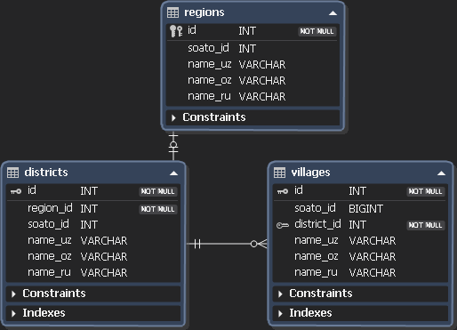

# 🌍 Regions, Districts &amp; Quarters Database

Full Database of regions Uzbekistan available in JSON, SQL  &amp; CSV Format All Regions, Districts &amp; Quarters with Latin, Cyrillic and Russian versions.


## Formats Available
- JSON
- SQL
- XML
- PLIST (Soon)
- YAML (Soon)
- CSV

## Distribution Files Info
File | JSON | SQL | XML | PLIST | YAML | CSV
:------------ | :-------------| :-------------| :------------- |:-------------|:-------------|:-------------
Regions / Cities | :white_check_mark: | :white_check_mark: | :white_check_mark: | :white_check_mark: | :white_check_mark: | :white_check_mark:
Districts | :white_check_mark: | :white_check_mark: | :white_check_mark: | :white_check_mark: | :white_check_mark: | :white_check_mark:
Quarters | :white_check_mark: | :white_check_mark: | :white_check_mark: | :white_check_mark: | :white_check_mark: | :white_check_mark:

## Database Backups
File | MySQL >= 5.6 | SQL Server >= 2017
:------------ | :-------------| :-------------
regions_mysql.sql | :white_check_mark: | N/A 
UzbekistanDB.bak | N/A | :white_check_mark: 

# Database Scheme Diagram




## Insights
Total Regions : 14 <br>
Total Regions/Cities : 210 <br>
Total Towns/Districts : 2,641+ <br>
Total Quarters (MFY) : 0 <br>

## Notes
```
There may be gaps between this information. 
Let us know if the information is incorrect or not entered!
```